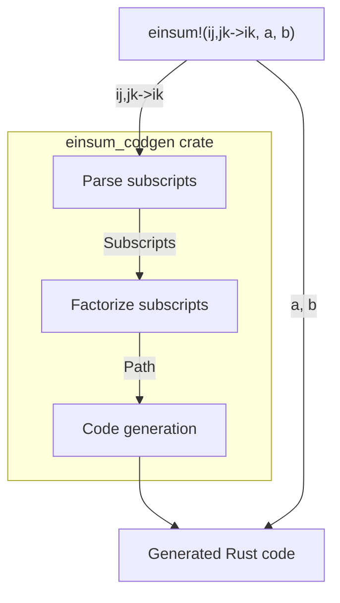

[前回の記事](./numpy-einsum)では既存実装としてNumPyにおける`numpy.einsum`の仕様を見ていきましたが、今回はRustの[ndarray crate](https://crates.io/crates/ndarray)向けにeinsumを作っていきます。完成形は次のようになります：

```rust
use ndarray::array;
use einsum_derive::einsum;

let a = array![
  [1.0, 2.0],
  [3.0, 4.0]
];
let b = array![
  [1.0, 2.0],
  [3.0, 4.0]
];
let c = einsum!("ij,jk->ik", a, b);
assert_eq!(c, array![
  [6.0, 8.0],
  [12.0, 16.0]
]);
```

この[`einsum_derive` crate](https://crates.io/crates/einsum-derive)は下記のリポジトリで開発されています：
https://github.com/termoshtt/einsum-derive

なお現在の実装では前回説明した省略記号`...`を含むeinsumはサポート出来ていません。またBLAS演算に置き換える操作もまだ実装されておらず、素朴なループによる実装を生成しています。

全体像は次の通りです：



einsum入門
-----------
実装の解説を始める前にeinsumの機能について少し見てみましょう。

理論物理等の文脈に置いて、アインシュタインの縮約記法というのは複数のテンソルを取る演算で和の記号$\sum$を省略、あるいは逆に補完するルールです。例えば$N$次元ユークリッド空間の二つのベクトル$x, y \in \mathbb{R}^N$の内積

$$
(x, y) = \sum_{i=1}^N x_i y_i
$$

を和の記号を省略して$x_i y_i$の様に表記します。逆に二つのベクトル$x, y \in \mathbb{R}^N$が与えられたとき、$x_i y_i$と書いたら上の和を考える事にします。添字に対する和は常に取りうる全ての値について取る事にして、例えば最初の二つだけ和を取る $x_1 y_1 + x_2 y_2$の様な処理は考えない事にします。他にも3つの$N \times N$行列$A, B, C \in M_N(\mathbb{R})$の積

$$
(ABC)_{il} = \sum_{j, k} A_{ij}B_{jk}C_{kl}
$$

を単に$A_{ij}B_{jk}C_{kl}$の様に表記します。複数回現れる添字についてのみ和を取ることにし、一回だけ現れる添字については和を取らない事にします。

上記の様な代表的な演算に付いては線形代数ライブラリ側にも対応した関数が用意されますが、このように複数のテンソルを受け取ってある添字に対して和を取る関数は非常にたくさん存在します。ではこれらの関数は自動的に作れないのでしょうか？そこでアインシュタインの縮約記法における和の補完規則の方に着目します。つまり$x_i y_i$と書くと二つのベクトルに対して内積を計算する演算を表すわけですが、これをさらに組$(x, y)$から$x_i y_i$に与える関数

$$
\mathbb{R}^N \times \mathbb{R}^N \ni (x, y) \longmapsto x_i y_i \in \mathbb{R}
$$

だと思って、この関数を`i,i->`と書くことにします。添字はアルファベット一文字であれば何でもよく、`i,i->`と`j,j->`は同じ関数を表すことにします。同じように3つの行列を引数に行列-行列-行列積を計算する関数

$$
M_N(\mathbb{R}) \times M_N(\mathbb{R}) \times M_N(\mathbb{R}) \ni (A, B, C) \longmapsto A_{ij}B_{jk}C_{kl} \in M_N(\mathbb{R})
$$

を`ij,jk,kl->il`と書きます。このように縮約記法でかける操作を、その添字のパターンを記述することで文字列として関数を指定する事ができます。この文字列を解釈して追加の引数としてもらったテンソルに対して実行する処理系の事をeinsumと呼びます。

手続きマクロによるコード生成
-----------------------------
Rustには標準で手続きマクロ(procedural macro, proc-macroとよく呼ばれる)と呼ばれる、Rustのコードを生成するコードをRustで記述できる機能が存在します。上の例で言えば `einsum!("ij,jk->ik", a, b)`の部分が手続きマクロの呼び出しに対応していて、これにより`"ij,jk->ik", a, b`を入力がRustのコードの構文木(というかトークン列)を出力とする関数

```rust
#[proc_macro]
pub fn einsum(input: TokenStream) -> TokenStream { ... }
```

に渡されて実行され、この実行結果のトークン列

```rust
{
    fn ij_jk__ik<T, S0, S1>(
        arg0: ndarray::ArrayBase<S0, ndarray::Ix2>,
        arg1: ndarray::ArrayBase<S1, ndarray::Ix2>,
    ) -> ndarray::Array<T, ndarray::Ix2>
    where
        T: ndarray::LinalgScalar,
        S0: ndarray::Data<Elem = T>,
        S1: ndarray::Data<Elem = T>,
    {
        let (n_i, n_j) = arg0.dim();
        let (_, n_k) = arg1.dim();
        {
            let (n_0, n_1) = arg0.dim();
            assert_eq!(n_0, n_i);
            assert_eq!(n_1, n_j);
        }
        {
            let (n_0, n_1) = arg1.dim();
            assert_eq!(n_0, n_j);
            assert_eq!(n_1, n_k);
        }
        let mut out0 = ndarray::Array::zeros((n_i, n_k));
        for i in 0..n_i {
            for k in 0..n_k {
                for j in 0..n_j {
                    out0[(i, k)] = arg0[(i, j)] * arg1[(j, k)];
                }
            }
        }
        out0
    }
    let arg0 = a;
    let arg1 = b;
    let out0 = ij_jk__ik(arg0, arg1);
    out0
}
```

が`einsum!`の呼び出し部分に置換されて本来のコンパイルが行われます。ユーザーはこのようなコード生成が行われている事に全く気づかないまま、特別なコード生成の為の設定を記述すること無く、通常の`println!`等のマクロの様に使うことが出来ます。

今回は手続きマクロを用いてeinsumを実装するため、実行時の情報であるテンソルの形状とstrideの情報が得られません。可能であればテンソルの形状とstrideの情報を持った上で計算する順序を決定する方が有利になり得ますが、この設計では全てのサイズが同一であると仮定してその最適化は初めから諦めます。

Subscriptのパース
-----------------
TODO: nomを使ってパースするよ(´・ω・｀)

einsumの分解
-------------
例えば3つの$N \times N$行列$A, B, C$の積$ABC$を考えましょう

$$
(ABC)_{il} = \sum_{j, k} A_{ij} B_{jk} C_{kl}
$$

この処理はeinsumの記法でいうと`ij,jk,kl->il`と書けます。これは素朴に計算すると、各添字$(i, l)$に対して右辺は$N^2$個の項の和になるので全体で計算量は$O(N^4)$必要になります。一方よく知られている様に行列の積は結合的なので、一旦$A$と$B$の積を先に計算してしまって次に$(AB)C$を計算しても同じ結果になります。そこで上の処理を

$$
\begin{align*}
  (AB)_{ik}  &= \sum_{j} A_{ij} B_{jk} \\
  (ABC)_{il} &= \sum_{k} (AB)_{ik} C_{kl}
\end{align*}
$$

の様に分けて中間の行列$AB$をメモリに保持する事にすると、それぞれの計算量は各$(i,k)$に対して$N$個の和を取ることになるので$O(N^3)$となり、それぞれを一回ずつやればいいので全体でも$O(N^3)$となります。つまり$O(N^4)$の計算が必要だったものを$O(N^2)$個の中間値をメモする事で$O(N^3)$の計算量に落とす事が出来ました。

### テンソルの名前管理
これをeinsumの記法で書くとどうなるのでしょうか？直感的には`ij,jk,kl->il`を`ij,jk->ik`と`ik,kl->il`に分解したように見えますが、これだと一つ目の`ik`と二つ目の`ik`が対応している事が上手く表せていません。そこで元の数式の通り、ここにどのテンソルを使うのかを追加した記法を用意しましょう。まず分解前のeinsumを

```
ij,jk,kl->il | arg0,arg1,arg2->out0
```

のように`|`で区切った右側にテンソルの名前を記述します。引数として取るテンソルはその順番に応じて`arg{N}`、einsumが生成するテンソルは`out{N}`のように名前を付けます。この表記を使うと上記の分解は次の様に書けます

```
ij,jk->ik | arg0,arg1->out1
ik,kl->il | out1,arg2->out0
```

処理は上から順番に実行されることにします。これで途中で生成される$AB$に対応するテンソル値の名前は`out1`であり、それが一つ目のeinsumで生成された出力であって、二つ目の処理で第一引数として使われることが分かります。この様にテンソルに名前をつけた状態で並べたものをパスと呼ぶことにします。コード上では [einsum_codgen::Path](https://docs.rs/einsum-codegen/latest/einsum_codegen/struct.Path.html)が対応します。

この表記法は単に私の好みで、こうである必要は無いです。例えば元の数式に近づけて
```
arg0 @ ij, arg1 @ jk, arg2 @ kl -> out0 @ il
```
の様に書くことも出来ます。重要なのは分解を記述するにはテンソルにパスの中で有効な名前をつける必要があるという点です。

### 分解順序と計算量
この分解はいつ可能でしょうか？行列積の場合は自明に分解出きることが分かりましたが、一般のユーザー入力に対してどのように分解するかをどう決めればいいのでしょう？
この問題を考えるため、上の例を少し書き換えてみましょう：

$$
(ABC)_{il} = \sum_{j, k} A_{ij} B_{jk} C_{kl} = \sum_{k} C_{kl} \sum_j A_{ij} B_{jk}
$$

一つの$\sum$を二つの$\sum$に分ける際に、内側と外側のテンソルの組($\{ A, B \}$ と $\{ C \}$)と添字の組($\{ j\}$と$\{k\}$)が分かれている事が分かります。内側と外側のテンソルと添字の組のいずれも空にならない場合を分解可能あるいは可約、出来ない場合を既約と呼ぶ事にしましょう。この分解は例えば上の例では$(AB)C$と$A(BC)$の分解が可能な事から分かるように一意ではありません。

この分解は再帰的に行うことが出来ます。例えば行列-行列-ベクトル積$ABCv$を考えてみましょう。これは`ij,jk,kl,l->i`と書けますが、まず最後の行列-ベクトル積を行うことで

```
kl,l->k    | arg2,arg3->out1
ij,jk,k->i | arg0,arg1,out1->out0
```

となります。さらに二つ目のeinsumを同じように最後の行列-ベクトル積を選んで分解することにより

```
kl,l->k | arg2,arg3->out1
jk,k->j | arg1,out1->out2
ij,j->i | arg0,out2->out0
```

のように行列-行列積を計算することない3段の行列-ベクトル積の形に分解され、計算量は$O(N^2)$で済みます。一方で最初に先頭の行列-行列積を選んでしまうと

```
ij,jk->ik  | arg0,arg1->out1
ik,kl,l->i | out1,arg2,arg3->out0
```

再び先頭の行列-行列積を選ぶと

```
ij,jk->ik | arg0,arg1->out1
ik,kl->il | out1,arg2->out2
il,l->i   | out2,arg3->out0
```

のように分解され、これ以上分解できません。この形では計算量は$O(N^3)$かかります。このように分解の方法によって必要な計算量が変化します。

現在の実装(0.1.0)では全パターンの分解に対して計算量とメモリのオーダーを計算し、最小の`Path`を計算するようになっています。

コード生成
-----------
最後に求まった`Path`からRustのコードを生成します。上述した様にeinsumのsubscriptは関数を表すので、例えば`ij,jk->ik`は二つの2次元配列を受け取り2次元配列を返す関数に展開されます。Rustの関数の識別子として`,`や`->`は使えないので、この部分をエスケープして関数名にします

```rust
fn ij_jk__ik<T, S0, S1>(
    arg0: ndarray::ArrayBase<S0, ndarray::Ix2>,
    arg1: ndarray::ArrayBase<S1, ndarray::Ix2>,
) -> ndarray::Array<T, ndarray::Ix2>
where
    T: ndarray::LinalgScalar,
    S0: ndarray::Data<Elem = T>,
    S1: ndarray::Data<Elem = T>,
{ ... }
```

この関数は`einsum!`マクロのユーザーからは直接見えてほしくないので、スコープを作ってその中で定義します。つまり

```rust
let c = einsum!("ij,jk->ik", a, b);
```

を次の様に展開します：

```rust
let c = {
    // 必要な関数を定義する
    // この関数はこのスコープの外からは見えない
    fn ij_jk__ik<T, S0, S1>(
        arg0: ndarray::ArrayBase<S0, ndarray::Ix2>,
        arg1: ndarray::ArrayBase<S1, ndarray::Ix2>,
    ) -> ndarray::Array<T, ndarray::Ix2>
    where
        T: ndarray::LinalgScalar,
        S0: ndarray::Data<Elem = T>,
        S1: ndarray::Data<Elem = T>,
    { ... }

    // マクロの引数の名前を整理
    let arg0 = a;
    let arg1 = b;

    // ↑で作った関数を呼び出し
    let out0 = ij_jk__ik(arg0, arg1);

    // ブロックから値を返す
    out0
};
```

複数のeinsumに分解されているときは対応する関数をまず定義して、上で議論したテンソルの名前を頼りに順番にそれらを呼び出していきます。
