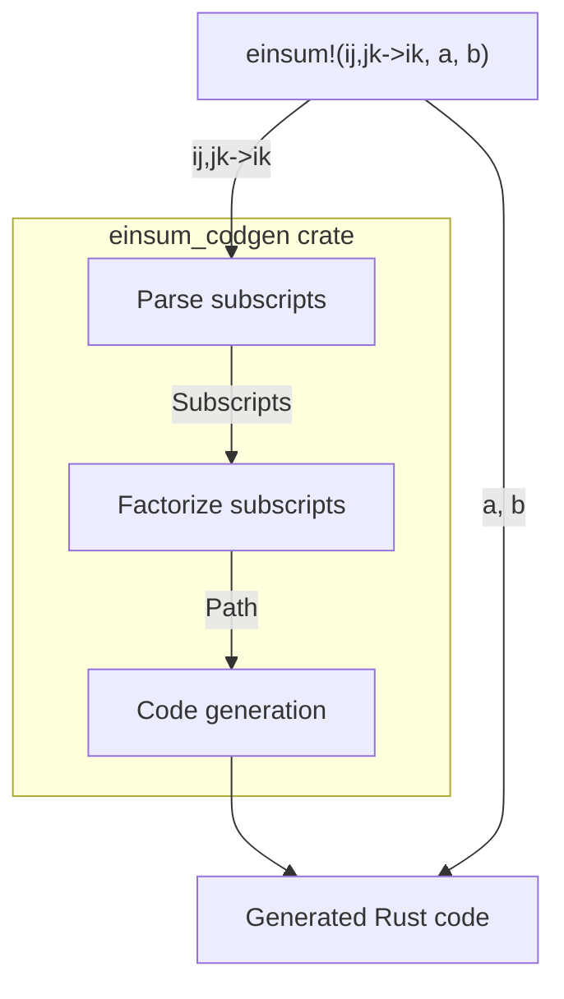

[前回の記事](./numpy-einsum)では既存実装としてNumPyにおける`numpy.einsum`の仕様を見ていきましたが、今回はRustの[ndarray crate](https://crates.io/crates/ndarray)向けにeinsumを作っていきます。完成形は次のようになります：

```rust
use ndarray::array;
use einsum_derive::einsum;

let a = array![
  [1.0, 2.0],
  [3.0, 4.0]
];
let b = array![
  [1.0, 2.0],
  [3.0, 4.0]
];
let c = einsum!("ij,jk->ik", a, b);
assert_eq!(c, array![
  [6.0, 8.0],
  [12.0, 16.0]
]);
```

この[`einsum_derive` crate](https://crates.io/crates/einsum-derive)は下記のリポジトリで開発されています：
https://github.com/termoshtt/einsum-derive

なお現在の実装では前回説明した省略記号`...`を含むeinsumはサポート出来ていません。またBLAS演算に置き換える操作もまだ実装されておらず、素朴なループによる実装を生成しています。

全体像は次の通りです：



RustによるRustのコード生成
---------------------------
Rustには標準で手続きマクロ(procedural macro, proc-macroとよく呼ばれる)と呼ばれる、Rustのコードを生成するコードをRustで記述できる機能が存在します。上の例で言えば `einsum!("ij,jk->ik", a, b)`の部分が手続きマクロの呼び出しに対応していて、これにより`"ij,jk->ik", a, b`を入力がRustのコードの構文木(というかトークン列)を出力とする関数

```rust
#[proc_macro]
pub fn einsum(input: TokenStream) -> TokenStream { ... }
```

に渡されて実行され、この実行結果のトークン列

```rust
{
    fn ij_jk__ik<T, S0, S1>(
        arg0: ndarray::ArrayBase<S0, ndarray::Ix2>,
        arg1: ndarray::ArrayBase<S1, ndarray::Ix2>,
    ) -> ndarray::Array<T, ndarray::Ix2>
    where
        T: ndarray::LinalgScalar,
        S0: ndarray::Data<Elem = T>,
        S1: ndarray::Data<Elem = T>,
    {
        let (n_i, n_j) = arg0.dim();
        let (_, n_k) = arg1.dim();
        {
            let (n_0, n_1) = arg0.dim();
            assert_eq!(n_0, n_i);
            assert_eq!(n_1, n_j);
        }
        {
            let (n_0, n_1) = arg1.dim();
            assert_eq!(n_0, n_j);
            assert_eq!(n_1, n_k);
        }
        let mut out0 = ndarray::Array::zeros((n_i, n_k));
        for i in 0..n_i {
            for k in 0..n_k {
                for j in 0..n_j {
                    out0[(i, k)] = arg0[(i, j)] * arg1[(j, k)];
                }
            }
        }
        out0
    }
    let arg0 = a;
    let arg1 = b;
    let out0 = ij_jk__ik(arg0, arg1);
    out0
}
```

が`einsum!`の呼び出し部分に置換されて本来のコンパイルが行われます。ユーザーはこのようなコード生成が行われている事に全く気づかないまま、特別なコード生成の為の設定を記述すること無く、通常の`println!`等のマクロの様に使うことが出来ます。

今回は手続きマクロを用いてeinsumを実装するため、実行時の情報、特にstrideの情報が得られません。行列積の様な計算では計算コアにデータが届いてからの計算と同様にキャッシュやメモリからデータを取得する部分が重要に成るため、可能であればメモリ上にデータがどう並んでいるかの情報を持った上で計算する順序を決定する方が有利になり得ますが、この設計ではその最適化は初めから諦めます。

einsum subscriptのパース
-------------------------
TODO: nomを使ってパースするよ(´・ω・｀)

einsumの分解
-------------

