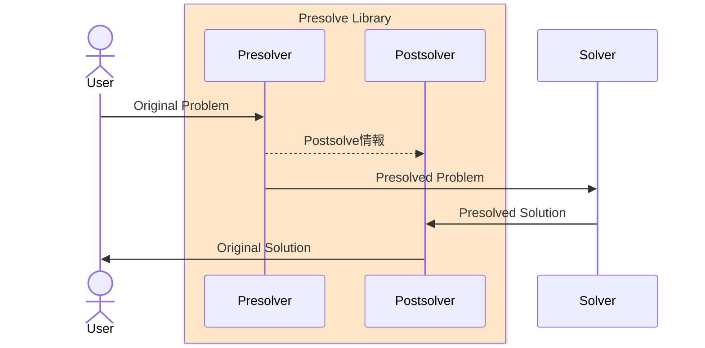
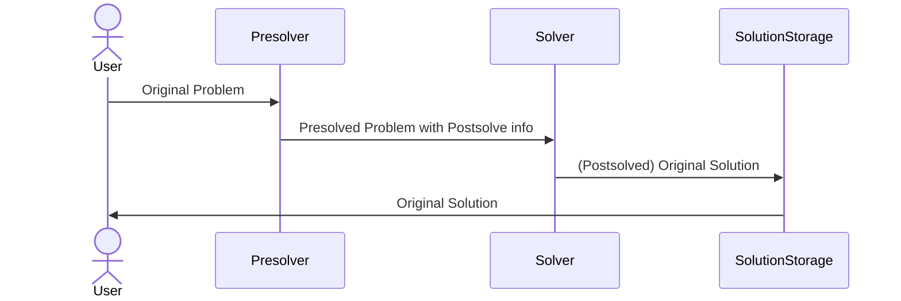

# Presolveとは

Presolveは数理最適化問題をソルバーに投げる前に問題を簡略化するための前処理技術です。

よく知られているように整数を含む線形計画問題(MILP)ですらNP困難であり、問題の規模が大きくなると汎用ソルバーでは解くのが非常に難しくなります。しかしこれは「どんなMILPが来ても高速に解くことができる」という汎用ソルバーがないという意味であり、個々のMILP問題が実際に解くのが難しいのかは別問題です。つまり問題固有の情報を活用することによって大規模な問題であっても高速に解けるケースというのが存在します。問題固有の情報を活用するアプローチにはいくつかあり、代表的なものは次の通りです。

- Presolve による問題の簡略化
- より小さい問題に対する結果を使って元の問題の解を得る分割手法（列生成法等）
- 問題特化型ヒューリスティクス（TSP専用ソルバー等）

この記事ではPresolveについて簡単に解説していきます。Presolveは問題分割手法やあるいはソルバー本体の一部としても活用される非常に基礎的な技術です。Presolveは単一のアルゴリズムがあるわけではなくて、多数の特化的な手法の集合です。主な目的としては次の二つです

- 決定変数の数を減らす、決定変数の取りうる値の範囲を狭める
- より強い実効的な制約を追加して探索空間を狭める、不要な制約を削除する

特にMILPは決定変数の個数に対して指数的に計算量が増加するため、決定変数の数を減らすことは非常に重要です。

## Bound strengthening

まずはわかりやすい単純な例から始めていきましょう。例えば次のようなMILPを考えます。

$$
\begin{align*}
\text{maximize} \quad & x_1 + x_2 \\
\text{subject to} \quad & 2x_1 + 3x_2 \leq 12 \\
& x_1, x_2 \geq 0 \\
& x_1, x_2 \in \mathbb{Z}
\end{align*}
$$

$x_1$ も $x_2$ も非負整数ですが上界が設定されていません。しかし制約条件から

$$
x_1 \leq \frac{1}{2} \left( 12 - 3 x_2 \right) \leq 6 \quad (\because x_2 \geq 0)
$$

であることがわかり、同様に $x_2 \leq 4$ もわかります。なのでこの MILP はより定義域の狭い次の問題に置き換えることができます。

$$
\begin{align*}
\text{maximize} \quad & x_1 + x_2 \\
\text{subject to} \quad & 2x_1 + 3x_2 \leq 12 \\
& x_1 \in [0, 6] \cap \mathbb{Z}, x_2 \in [0, 4] \cap \mathbb{Z}
\end{align*}
$$

これは特に制約条件が線形の場合は係数の符号によって最小値か最大値を取ってくればいいだけなので高速に計算できます。これはより強いBoundを設定するという意味で "Bound strengthening" と呼ばれます。

:::message
後述するJijPresolveでは非線形項に対しても区間演算を使ってBound strengtheningを行います
:::

少し別の視点から見ると、この手続きはBoundを使ってBoundを強化していることから "Domain propagation" とも呼ばれます。他の、より問題特化なPresolveによって得られたより強いBoundを使って他の変数のBoundも強化することができるため、他のPresolveと組み合わせることによってより強力な効果を発揮します。このようにPresolveは複数の操作を組み合わせて実行することが基本となります。

## Coefficient strengthening

Presolveの手法は膨大なので網羅的に説明するのは難しいです。MILPのPresolveに限ってもいくつかPresolveのクラスが存在して

- 単一の制約条件で完結するもの
- 複数の制約条件を組み合わせて実行するもの
- 制約条件に加えて目的関数も活用するもの (dual presolve)

があります。先ほどの例では単一の制約条件からBound strengtheningを行う方法を説明しましたが、もう一つ基本的な単一の制約条件で完結するPresolveを紹介しましょう。

Coefficient strengtheningというのを紹介します。これはある制約条件に対してそこに含まれる決定変数が整数のみの時、feasibleな整数を変化させずに係数による制約（つまりLP緩和した時のfeasible領域）を小さくする事ができる手法です。整数線形計画ソルバーではLP緩和問題（整数変数を実数変数として扱う問題）を解き、その結果を元に分枝限定法(branch-and-bound)などの手法で整数解を探索します。LP緩和問題のfeasible領域が小さければ小さいほど、分枝限定法で探索する必要のある領域が小さくなるため、Coefficient strengtheningは整数線形計画ソルバーの性能向上に寄与します。

簡単のため2変数 $x, y \in \mathbb{Z}$ で説明します。実数係数 $a, b > 0$ として次のような制約条件を考えます。

$$
a x + b y \leq c
$$

$x$ についてのcoefficient strengthenというのは $x$ の最大値 $\bar{x} \in \mathbb{Z}$ と $ax$ 以外の左辺項 $by$ （今は１項だけだが変数が増えると増える）の上限が $by \leq u$ のように与えられた時、 $a, c$ の組を更新してfeasibleな整数点を維持したままLP緩和した時の領域を削る方法です。


今の制約条件 $ax + by \leq c$ に相当する赤い線を、新しい制約条件 $a'x + by \leq c'$ に相当する青い線に置き換えます。変更前のLP緩和の実行可能領域が図中のハッチ領域（$x \leq \bar{x}, y \leq u/b$）で、変更後は図中の緑のハッチ部分が実行可能領域から安全に削除できるという手続きです。

$x$は整数なので $\bar{x}$ と $\bar{x} - 1$ の間には整数点が存在しません。なので青い直線 $a'x + by = c'$ は2点 $(\bar{x}, (c - a\bar{x}) / b)$ 及び $(\bar{x} -1, u/b )$ を通れば良いことが図からわかり、次の連立方程式

$$
\begin{align*}
a' \bar{x} + c - a \bar{x} &= c' \\
a' (\bar{x} - 1) + u &= c'
\end{align*}
$$

を解いて $(a', c')$ を求めることができます。この値を使って制約条件を $a'x + by \leq c'$ に置き換えればCoefficient strengtheningの完了です。

# JijPresolve

JijPresolveはOMMX Instanceに対するPresolveを提供するライブラリです。現在は主に次の二つを提供しています。

- [SCIP/PaPILO](https://github.com/scipopt/papilo) によるMILP問題のPresolve
- 非線形問題にも適用できるTrivial Presolve

:::message
実際には包括的な C API の追加と共有ライブラリとしてのビルド・配布をサポートしたフォーク [Jij-Inc/libpapilo](https://github.com/Jij-Inc/libpapilo) を使っています
:::

JijPresolveは現在[JijZept SDK/IDE](https://www.jijzept.com/ja/)の一部として提供されています。ドキュメントは以下のGitHub Pagesで公開され誰でも閲覧できます。

https://jij-inc.github.io/JijPresolve/autoapi/jijpresolve/index.html

OMMXのようにOSSではないので注意してください。JijPresolveはPythonパッケージとして提供され、OMMX Instanceを受け取ってPresolveされたOMMX Instanceを返します。以下に簡単な使用例を示します。

```python
from ommx.v1 import DecisionVariable, Instance
import jijpresolve

x = [DecisionVariable.integer(i, lower=0, upper=10) for i in range(3)]
ommx_instance = Instance.from_components(
    decision_variables=x,
    objective=sum(x),
    constraints=[
        (x[0] + x[1] + x[2] <= 5).set_id(0),
    ],
    sense=Instance.MAXIMIZE,
)

presolved_instance, stats = jijpresolve.milp_presolve(ommx_instance)

print(stats['rounds'])  # 2
print(stats['deleted_columns'])  # 3
```

これによりOMMXでサポートされた任意のソルバーに対してPresolveを実行することが出来るようになります。

## Postsolve by OMMX

Presolveは決定変数を固定したり制約条件を削除・追加したり、最適化問題に対して大きな変更を加えます。しかしユーザーは自分が入力した制約条件や決定変数が、たとえ数学的に正しい変形だとしても、「自分が入力した通りの形で」解かれることを期待しています。したがってPresolveして変形した問題をソルバーで解いた後に、Presolve前の問題に対する解を復元するための処理が必要となり、Postsolveと呼ばれます。JijPresolveの特徴はこのPostsolveがOMMXによって実現されている点です。

https://github.com/Jij-Inc/ommx

実はOMMXというのはPresolveの開発のために設計されたフレームワークです。Jij社内で当時使っていたJijModelingの処理系にPresolveを実装するのが私がJijに参加した当初からの重要な課題でした。これまで説明してきた通りSCIPなどの既存のMILPソルバーはPresolveをかなり高度に活用していますが、例えばOpenJijといったQUBOソルバーはPresolveなどという数理最適化の専門的な技術は全く使っておらず、既存のソルバーに比べて同じスタート地点に立つことすら出来ていませんでした。特にMIPLIBのようなアカデミックなベンチマークセットなどはPresolveが行われた状態で提供されていることが多いですが、実務で使う場合はPresolveを行っていない元の問題が与えられることが多いため、Presolveを実装することは非常に重要でした。

Presolve/Postsolveの実装においてOMMXの重要な設計思想の一つがデータフローです。例えば PaPILO のような Presolve Library は次のようなデータフローを取ります。



このように、通常Postsolveの情報をソルバーに渡しません。これはソルバーはそんな情報を必要としていないので自然な設計に見えますが、この設計だとソルバーの返した解を解釈するためにPostsolverにアクセスする必要があります。これは同一マシン上でPresolveを行ってSolverで解きPostsolveを行う場合は問題になりませんが、例えばクラウド上でPresolveとSolverを分離したい場合などには不便で、Presolveされた問題とPostsolve情報を一緒に保存・転送する必要が出てきます。

これを踏まえてOMMXでは `ommx.v1.Instance` にPresolveされた問題自体に加えて、Postsolveのために必要な情報とそれを実際に反映する機能があらかじめ組み込まれています。これにより次のような単純なデータフローを実現できます。



# 参考文献

- [Achterberg, T., Bixby, R. E., Gu, Z., Rothberg, E., & Weninger, D. (2016). Presolve reductions in mixed integer programming (ZIB Report 16-44). Zuse Institute Berlin.](https://opus4.kobv.de/opus4-zib/frontdoor/deliver/index/docId/6037/file/Presolve.pdf)

# 最後に

Jijでは今回紹介したJijPresolveの開発も含め、各ポジションを積極的に採用しています！

現在の募集職種は、以下リンクよりご覧いただけます。
カジュアル面談からのスタートも大歓迎ですので、お気軽にご連絡ください。
https://open.talentio.com/r/1/c/j-ij.com/homes/1900
