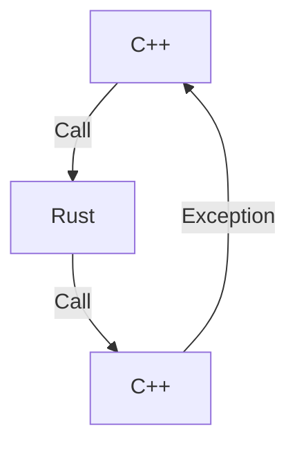

Rust 1.71.0で`C-unwind` ABIが安定化されました
https://blog.rust-lang.org/2023/07/13/Rust-1.71.0.html#c-unwind-abi

これによりFFI境界を越えて処理を巻き戻せるようになります。例えばC++からRustの関数を呼び出し、RustからさらにC++の関数を呼び出しているとき、一番内側のC++関数が例外を投げると従来はそれをRustの層を越えて元のC++側に伝搬させる事が出来ませんでしたが、1.71.0からは可能になります。



今回実験したコードは以下にあります。
https://github.com/termoshtt/cpp-exception-testing

まずRust側から見ていきましょう。

```rust:main.rs
#[no_mangle]
extern "C-unwind" fn rust_middle_func(callback: extern "C-unwind" fn()) {
    let _a = A {}; // test destructor
    callback(); // This raises C++ exception

    // Following will not be executed
    unreachable!("End of rust_middle_func");
}
```

C++側から`rust_middle_func`をFFIで呼び出し、さらに引数にコールバック関数を渡します。`rust_middle_func`は受け取った`callback`を呼ぶだけですが、`Drop`のテストのために一つ構造体を用意します。

```rust
struct A {}
impl Drop for A {
    fn drop(&mut self) {
        println!("Drop A in Rust");
    }
}
```

Rustが`callback`を呼び出してそれが例外を投げたとき、呼び出したRust側での処理も中断してしまうので、確保した構造体(この場合`_a`)の後片付けをする必要があります。

次にC++の方を見てみます。

```cpp:foo.cpp
extern "C" {
  void throw_cxx_exception() {
    std::cout << "Throwing C++ exception" << std::endl;
    throw std::runtime_error("C++ Runtime error");
  }

  void rust_middle_func(void (*callback)());

  void test_cxx_exception() {
    try {
      rust_middle_func(throw_cxx_exception);
      std::cout << "End of C++ try block" << std::endl;
    } catch (const std::exception &e) {
      std::cout << "Catched: " << e.what() << std::endl;
      return;
    }
  }
}
```

Try-cache構文を使って、例外を投げるだけの関数`throw_cxx_exception`をFFIで`rust_middle_func`に渡します。Cargoを使いたいので`test_cxx_exception`はRust側から使います。

```rust:main.rs
extern "C" {
    fn test_cxx_exception();
}

fn main() {
    unsafe {
        test_cxx_exception();
    }
}
```

Cargoでリンクするのでcc crateを使います。

```rust:build.rs
fn main() {
    cc::Build::new()
        .cpp(true)
        .file("foo.cpp")
        .cpp_link_stdlib("stdc++") // use libstdc++
        .compile("foo");
}
```

これで準備が出来ました。

```shell
$ cargo run
    Finished dev [unoptimized + debuginfo] target(s) in 0.16s
     Running `target/debug/cpp-exception-testing`
Throwing C++ exception
Drop A in Rust
Catched: C++ Runtime error
```

この様にC++の例外がRustの層を跨いでやりとり出来ており、しかも途中でRust側の`Drop`もちゃんと呼ばれています。

`panic=abort`
--------------
以上は`panic=unwind`の時の挙動で

```Cargo.toml
[profile.dev-abort]
inherits = "dev"
panic = "abort"
```

のように`panic=abort`を指定した場合は

```
$ cargo run --profile=dev-abort
    Finished dev-abort [unoptimized + debuginfo] target(s) in 0.00s
     Running `target/dev-abort/cpp-exception-testing`
Throwing C++ exception
thread 'main' panicked at 'panic in a function that cannot unwind', library/core/src/panicking.rs:126:5
note: run with `RUST_BACKTRACE=1` environment variable to display a backtrace
thread caused non-unwinding panic. aborting.
```

の様にRustの層でC++の例外を検知した段階でabortするようです。

RustでC++の例外を受け取る
-------------------------
> Also note that unwinding into Rust code with a foreign exception (e.g. an exception thrown from C++ code) is undefined behavior.
https://doc.rust-lang.org/std/panic/fn.catch_unwind.html

のは出来ません(´・ω・｀)
