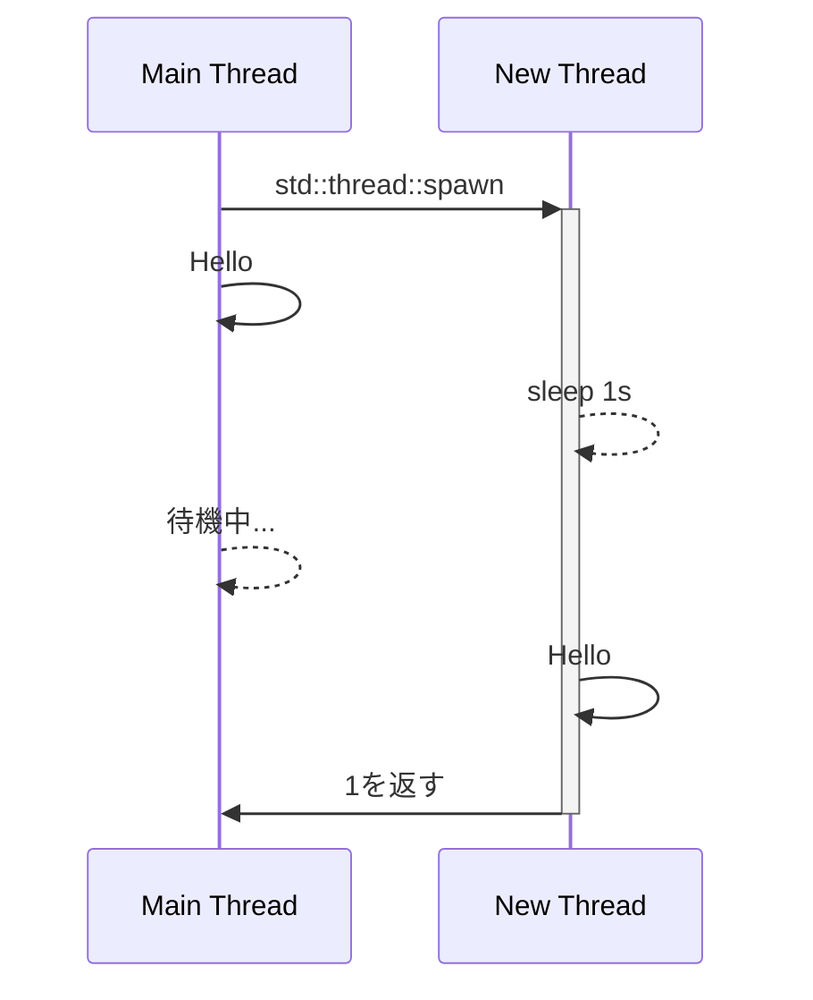

RustのOSスレッドに関するAPIを説明する前に、まずOSにおけるスレッドについて少し説明しましょう。以下では主にLinuxを想定して説明しますが、WindowsやmacOSでも概ね同じような内容になります。また、ここでの「OS」はカーネルを指します。

# プロセスとスレッド
OSはユーザーが起動した複数のアプリケーションを同時に実行する必要があります。例えば、この本で対象としているような数値計算では、通常はシェルで次のようにコマンドを実行して計算を開始します。

```shell
./a.out
```

この「./a.out」をアプリケーションと呼びます。OSは最初に、各アプリケーションごとにプロセスと呼ばれるリソースの管理単位を作成します。例えば、2つのアプリケーションを起動した場合、一方のアプリケーションが確保したメモリを他のアプリケーションから見えるようにしてしまうと、さまざまな問題が発生する可能性があります。そのため、確保されたメモリはプロセスによって管理され、他のプロセスからは見えないようにされます。

もう1つの重要なリソースがスレッドです。OSはプログラムの実行をスレッド単位で管理します。アプリケーションを起動すると、プロセス内にメインスレッドと呼ばれるスレッドが作成されます。このメインスレッドは `main` 関数を最初から実行し始めます。OSはCPUコアに対して多数のスレッドを順番に割り当てて実行させます。各スレッドの処理はすぐに終了しないことがあるため、OSは通常、一定の時間が経過するとCPUコアを別のスレッドに割り当て、それまで実行していたスレッドは待機状態になります。この方法により、OSは複数のスレッドを同時に実行しているかのように見えます。

プロセスは起動時にメインスレッドが作成されますが、追加のスレッドも作成できます。新しいスレッドも同じプロセスに属するため、メモリなどのリソースはそのプロセス内のスレッドと共有されます。OSは各スレッドを異なるCPUコアに割り当てるため、複数のCPUコアがある場合、複数のスレッドが同時に実行されます。これらのスレッドは独立して動作するため、例えば同じメモリ位置に同時に書き込もうとすると問題が発生します。これを防ぐために、ハードウェアレベル、OSレベル、プログラムレベルでさまざまな対策が取られており、このページではそれらをRustから使用する方法についてまとめていきます。

# スレッドの作成
スレッドを起動するには、OSにスレッドを起動するように指示する必要がありますが、Rustでは標準ライブラリがOSに依存した処理を隠蔽して、プログラムからはOSに依存した処理を意識することなくスレッドを起動できるようになっています。スレッドを起動するには [`std::thread::spawn`](https://doc.rust-lang.org/std/thread/fn.spawn.html) 関数を使用します。

```rust
let thread = std::thread::spawn(|| {
    // ここは新しいスレッドで実行される

    // まず1秒待つ
    std::thread::sleep(std::time::Duration::from_secs(1));

    // 新しいスレッドからのメッセージを表示する
    println!("Hello from new Thread!");

    // 1を返す
    return 1;
});

// ここは新しいスレッドを生成した直後にメインスレッドで実行される
println!("Hello from main Thread!");

// 新しいスレッドの終了を待つ。新しいスレッドに渡した関数の戻り値を取得できる
let result = thread.join().unwrap();
assert_eq!(result, 1);
```

メインスレッドは新しいスレッドを起動した後、その処理が終了するのを待たずに次の処理に移ります。スレッドを起動したときに得られる [`JoinHandle`](https://doc.rust-lang.org/std/thread/struct.JoinHandle.html) を [`join()`](https://doc.rust-lang.org/std/thread/struct.JoinHandle.html#method.join) することによって、起動したスレッドの処理が終了するのを待ち、渡した関数の戻り

値を取得できます。全体の流れを図で表すと次のようになります：



# スレッド間でのデータのやりとり
先ほど同じプロセスに所属しているスレッドは同じメモリを共有しているといいましたが、Rustではこの機能を大きく制限しています。というのも、同時に動作している複数のスレッドから共有されたメモリを正しく読み書きすることは非常に難しい処理で、これをユーザーの責任にすると発見すら困難な多くのバグが発生してしまうからです。こうしたアプローチでは、並列処理が [The Art of Multiprocessor Programming](https://www.sciencedirect.com/book/9780124159501/the-art-of-multiprocessor-programming) を通読したプロフェッショナルだけのものに制約されてしまいます。そこで、Rustはコンパイラの責任において正しくない共有メモリの読み書きを禁止する型システムと、その中で正しいコードを簡単に記述できるAPIを提供しています。

## Shared XOR mutability
複数のスレッドでデータを受け渡す最も簡単な方法は、スレッド起動時にデータを渡し、終了時に回収する方法です。こうすれば同時に複数のスレッドからアクセスされることはないため、常に安全だと思うかもしれませんが、これにも問題が存在します。

例えば、ポインタを別のスレッドに渡す場合を考えてみましょう。新しいスレッドを起動するときにポインタを渡すと、もしそのポインタ自体のメモリを複数のスレッドからアクセスできないようにしても、元のスレッドの別の変数に同じメモリへのアドレスがあれば、それを使用して両方のスレッドから同時に同じメモリに読み書きできてしまいます。つまり、あるメモリへアクセスできる変数をすべて把握していない限り、メモリを安全に操作することはできません。この問題は一般的に難解であり、多くのプログラミング言語ではプログラマの責任とされています。

しかし、Rustではあるメモリに対して、不変な参照 `&'a T` がたくさんあるか、可変な参照 `&'a mut T` が一つあるか、どちらか一方であることが保証されています。この性質（Shared XOR mutabilityとしてよく知られています）は、シングルスレッドのプログラムでも多くのバグを防ぐのに役立ちますが、マルチスレッドのプログラミングでは非常に強力な性質となります。複数のスレッドに参照が分散している場合でも、読み取り専用のスレッドが多数存在するか、単一のスレッドだけが書き込みを行い、他のスレッドは読み取りだけを行う場合、メモリの安全性が保証されるためです。

## `Send`と`Sync`
では、自分で作成した構造体も可変参照を持つ場合は一つのスレッドにしか存在できず、不変参照を持つ場合は複数のスレッドで共有できる、というルールを自分で判断しなければならないのでしょうか？実は、コンパイラが自動的にこの判断を行ってくれます。

Rustでは、全ての型に対してマーカーであるTrait `Send` と `Sync` がコンパイル時に適切に実装できるかどうかを検査します。

:::message
ある型`T`と寿命`'a`に対して`&'a T`や`&'a mut T`は、`T`とは異なる独自の型であることに注意してください。
:::

- `T: Send`: 型`T`の変数は別のスレッドに渡すことができます。
- `T: Sync`: 型`T`の変数は複数のスレッドで共有できます。つまり、任意の `'a` に対して `&'a T: Send` であることが必要です。

これらのトレイトはユーザーが定義した型も含めて自動的に実装され、通常のTrait境界と同じように使用できます。

```rust
fn f<T: Send>(_: T) {
    dbg!(std::any::type_name::<T>()); // &mut i32
}

fn main() {
    let mut x = 1;
    f(&mut x)
}
```

前述の説明のように、基本的にはポインタは複数のスレッドで共有することが危険なため、`*mut T` 型に対しては `impl !Send for *mut T` および `impl !Sync for *mut T` となっています。この `!` は否定の意味を持ち、一部の組み込みTraitにのみ許可されています。例えば、Cで提供されるライブラリのFFIを使用してマルチスレッド環境で利用する場合は、そのライブラリのマニュアルに従ってスレッドセーフになるように `Send` および `Sync` を実装する必要がありますが、この処理は `unsafe impl` という特殊な構文を使用します。

`Send` トレイトを活用することで、新しいスレッドを起動する関数 `std::thread::spawn` は次のように定義されます。

```rust:ignore
pub fn spawn<F, T>(f: F) -> JoinHandle<T>
where
    F: FnOnce() -> T + Send + 'static,
    T: Send + 'static,
{ ... }
```

この例では、クロージャを引数に取り、その戻り値の型を指定しています。このクロージャの型 `F` およびその戻り値の型 `T` は、どちらも `Send` である必要があります。クロージャは値をキャプチャするため、キャプチャされる値の型も `Send` である必要があります。

## クロージャとキャプチャ
クロージャのキャプチャについてもう少し詳しく説明しましょう。Rustでは、`|arg| value` という構文を使用してクロージャを作成します。

```rust
let f = |a| a + 1;
dbg!(f(1)); // 2
```

この場合、引数ではなく、クロージャを定義するスコープ内にある変数をキャプチャできます。

```rust
let mut s = String::from("Hello");
let mut f = || s.push_str(" World!");
f();
dbg!(s); // "Hello World!"
```

Rustのクロージャは、定義内で使用される変数を自動的に **参照として** キャプチャします。この場合、`f` 内で `s.push_str` が呼ばれており、これは可変参照 `&'a mut String` が必要です。そのため、Rustは自動的にこれをキャプチャします。このとき、自動的に次のような型が定義されると考えるとわかりやすいです。

```rust:ignore
struct F<'a> {
    s: &'a mut String,
}
impl<'a> FnMut() for F<'a> { ... }
```

このクロージャの型は寿命 `'a` を持つことになります。一方、値をキャプチャする場合は `move |arg| value` という構文を使用します。

```rust
let mut s = String::from("Hello");
let f = move || {
    s.push_str(" World!");
    return s;
};
let new_s = f();
dbg!(new_s); // "Hello World!"
```

この場合、`f` の型は参照が必要なくなり、寿命は `'static` になります。また、一度呼び出すと `s` は消費されるため、`FnOnce` になります。さらにキャプチャされる変数が全て `Send` の場合は自動的にクロージャも `Send` になります。こうして `spawn` の引数である `F: FnOnce() -> + Send + 'static` が満たされるクロージャが得られます。

## チャンネル
次にスレッドの途中でデータを送る方法について説明しましょう。それにはチャンネルを使います。チャンネルは送信する側と受信する側の2つのエンドポイントから構成されます。チャンネルを作成するには [`std::sync::mpsc::channel`](https://doc.rust-lang.org/std/sync/mpsc/fn.channel.html) 関数を使用します。

```rust
let (sender, receiver) = std::sync::mpsc::channel();

// Spawn off an expensive computation
std::thread::spawn(move || {
    let one_s = std::time::Duration::from_secs(1);

    // 1秒毎に3回値を送る
    std::thread::sleep(one_s);
    sender.send(1).unwrap();

    std::thread::sleep(one_s);
    sender.send(2).unwrap();

    std::thread::sleep(one_s);
    sender.send(3).unwrap();

    // receiverがドロップされ、チャンネルが閉じられる
});

loop {
    // チャンネルからの値を待つ
    if let Ok(value) = receiver.recv() {
        println!("Got {}", value);
    } else {
        // チャンネルが閉じられたら `recv()` は `Err` を返すので終了する
        break;
    }
}
```

これはMulti-Producer Single-Consumerの略でMPSCチャンネルと呼ばれ、多数の送信者と一人の受信者からなります。なので送信用のエンドポイント `sender` は複製することができ、複数のスレッドから送ることができますが、受信用のエンドポイント `receiver` は一つしか存在できません。`sender`がドロップされると`recv()`に`ReceiveError`が発生し、逆に`receiver`がドロップされると`sender`から`send`する際に`SendError`が発生します。このチャンネルは "Unbound" つまりデータをいくらでも送ることができ、それらはメモリ上にバッファリングされます。これに対して、[`std::sync::mpsc::sync_channel`](https://doc.rust-lang.org/std/sync/mpsc/fn.sync_channel.html) はバッファリングされたデータが一定数を超えると送信側がブロックされるチャンネルです。

# データを共有とロック
以上は片方のスレッドから他方のスレッドにデータを送るという形をとっていましたが、実際には両方のスレッドでデータを読み書きする必要がある場合もあります。複数のスレッドにそれぞれ送信用・受信用のチャンネルを用意することもできますが、スレッド数が増えるとチャンネルの管理が難しくなります。そこで、複数のスレッドから同時にデータを読み書きする場合は、どのスレッドからでも読み書きできるメモリを用意し、そのメモリにアクセスする際に排他制御を行うのが一般的です。この場合の方法としてAtomicなデータ型とMutexがあります。

## Atomic
例えば複数のスレッドである型のオブジェクトをたくさん生成して、それらに通し番号をつけたいとします。逐次的に生成する時はまず整数のカウンタを一つ用意して、一つオブジェクトを作る毎に `+1` していけばこれが番号になります。同じようにして複数のスレッドで生成する場合にも一つ作るたびに共有しているカウンタの値を `+1` することにしましょう。しかしこの時問題が発生します。例えばカウンタの値が `2` であるときに同時に二つのスレッドから `+1` しようとしたとしましょう。それぞれのスレッドは

- まずカウンタの値を読み込み
- 一つ増やし
- カウンタに書き込む

という処理を行います。もしスレッドAが `2` を読み込んでから `3` を書きこむまでの間にスレッドBがカウンタの値を読み込んでしまった場合、スレッドB側でも同じく `2` を読み込んで `3` を書き込むことになるので、新しいオブジェクトは二つ増えたのにカウンタの値が１しか増えていないことになります。このような状態をデータ競合と言います。幸いRustではこのような危険な処理は `unsafe` 句を使って明示的に行わない限り禁止されています。

上の操作は値の読み込みと書き込みの間に他の処理が入らないことが保証できれば回避できます。特に整数についてはこの保証がある命令がCPUに用意されており、それを利用することで高速に操作しつつデータ競合を回避できます。例えば上のカウンタの例 [`AtomicUsize`](https://doc.rust-lang.org/std/sync/atomic/struct.AtomicUsize.html)は `fetch_add` という命令を使って次のように書くことができます。

```rust
use std::sync::atomic::{AtomicUsize, Ordering};

// Aをいくつ生成したかを覚えておくカウンタ
static COUNTER: AtomicUsize = AtomicUsize::new(0);

struct A {
    id: usize,
}
impl A { 
    fn new() -> A {
        // 読みこみとインクリメントを同時に行う
        let id = COUNTER.fetch_add(1, Ordering::Relaxed);
        A { id }
    }
}

let thread = std::thread::spawn(|| {
    let a = A::new();
    println!("Hello from new Thread! id: {}", a.id);
});

let a = A::new();
println!("Hello from main Thread! id: {}", a.id);

thread.join().unwrap();

// 両方のスレッドでAが生成されたので2になってるはず
assert_eq!(COUNTER.load(Ordering::Relaxed), 2);
```

ここで `COUNTER` が `static mut` になっていないのは `AtomicUsize::fetch_add` が値を増やすにも関わらず `&mut self` でなく `&self` を要求するからです。これは`RefCell<T>`型などで用いられる内部可変性と同じで、型システムのレベルではなくAPIのレベルで安全性を保証しているからです。詳しくは公式ドキュメントの[RefCell<T>と内部可変性パターン](https://doc.rust-jp.rs/book-ja/ch15-05-interior-mutability.html)等を見てください。`Ordering`についてはアトミック性を保証するだけなら最も弱い`Ordering::Relaxed`を使えば十分ですが、詳しくは[リファレンス](https://doc.rust-lang.org/std/sync/atomic/enum.Ordering.html)を読んでください。

## `Arc`と`Mutex`
浮動小数点数やユーザー定義型についてはアトミック命令は存在しないので、他のスレッドが同じメモリ領域を同時に操作できないように、ロックという同時に一つのスレッドしか取得できない仕組みを使います。

```rust
use std::sync::{Arc, Mutex};

// 'static で他のスレッドに渡すためにArcでラップする
let sum_main = Arc::new(Mutex::new(0.0));
// 新しいスレッドにあげるための参照
let sum_new = Arc::clone(&sum_main);

let thread = std::thread::spawn(move || {
    // Lockを取得する
    let mut sum = sum_new.lock().unwrap();

    // Lockを取得している間は他のスレッドはLockを取得できない

    // sumはMutexGuardという型で、Derefを実装しているので、
    // `*sum` で中身を取り出せる
    *sum += 1.0;

    // `sum` がドロップされるときに自動的にロックが解除される
});

{
    // メインスレッドでもロックを取得する
    // もし別スレッドでロックを取得している場合はここで待機する
    let mut sum = sum_main.lock().unwrap();

    *sum += 1.0;

    // `sum` がドロップされるときに自動的にロックが解除される
}

// 新しいスレッドの終了を待つ
// もしメインスレッドでロックを持ったまま待機してしまうとデッドロックする
thread.join().unwrap();

let sum = sum_main.lock().unwrap();
assert_eq!(*sum, 2.0);
```

ロックを取得するには[`Mutex`](https://doc.rust-lang.org/std/sync/struct.Mutex.html)の他に読み取りロックと書き込みロックを区別する[`RwLock`](https://doc.rust-lang.org/std/sync/struct.RwLock.html)があります。またロックを取得できなかった場合に待機せずに`Err`を即座に返す[`try_lock`](https://doc.rust-lang.org/std/sync/struct.Mutex.html#method.try_lock)関数もあります。

もし別スレッドが処理を行う前にメインスレッドがロックを保持し、そのまま別スレッドの終了を待機してしまった場合、両方のスレッドが先に進めなくなるためデッドロックと呼ばれる状況になります。残念ながらこれを防ぐのはプログラマの責任です。
