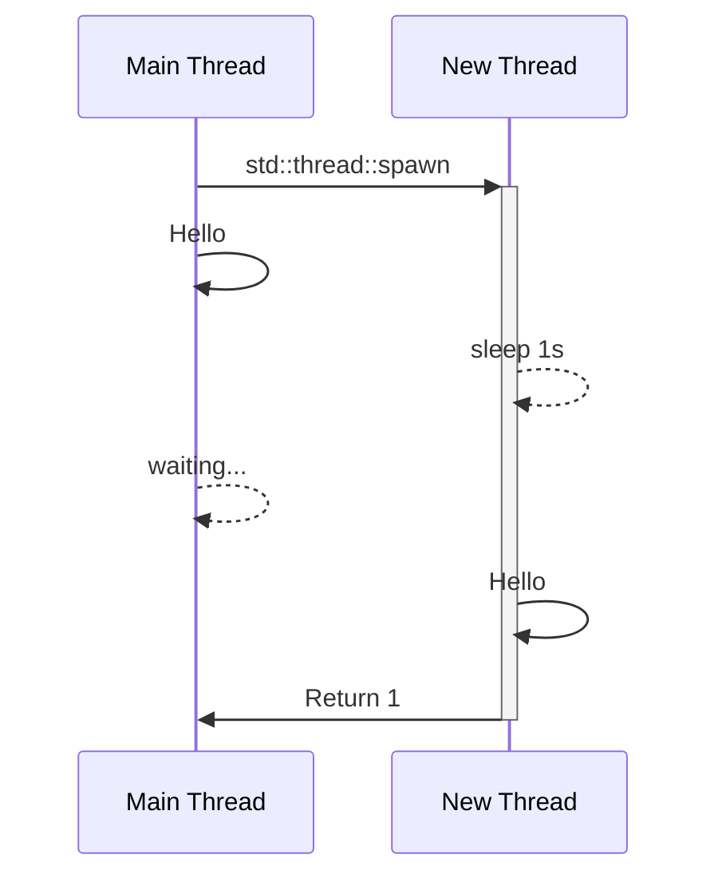

RustのOSスレッドに関するAPIを説明する前に、まずOSにおけるスレッドについて少し説明しましょう。以下では主にOSとしてLinuxを想定して説明しますが、WindowsでもmacOSでも概ね同じような内容になる部分だけを見ていきます。またカーネルの事を指してOSと呼びます。

# プロセスとスレッド
OSはユーザーが起動した複数のアプリケーションを同時に動かす必要があります。例えばこの本で対象としているような数値計算では、典型的にはシェルで

```shell
./a.out
```

のようにして計算を開始しますが、ここではこれをアプリケーションと呼びましょう。OSはまずアプリケーション毎にプロセスと呼ばれるリソースの管理単位を作ります。例えば二つのアプリケーションを起動したとき、片方のアプリケーションが確保したメモリをほかのアプリケーションから見れてしまうと色々困ります。そこで確保されたメモリはプロセスが管理するリソースとして扱い、別のプロセスからは見えないようにします。

もう一つの重要なリソースがスレッドです。OSはプログラムの実行をスレッドという単位で管理します。アプリケーションを起動するとプロセスの中にメインスレッドと呼ばれるスレッドが作られます。このメインスレッドは `main` 関数を最初から実行していきます。OSはCPUのコアに対してたくさんのスレッドを順番に割り当てて実行させます。それぞれのスレッドの処理はすぐに終わるとは限らないので、OSは典型的には一定の時間が経過するとCPUのコアを別のスレッドに割り当てて、それまで実行されていたスレッドは順番待ちになります。このようにしてOSは複数のスレッドを同時に実行しているように見せます。

TODO: ここにスレッド割り当ての図を入れる

プロセスには起動時にメインスレッドが作られますが、追加でスレッドを作ることもできます。新しいスレッドも同じプロセスに所属するので、メモリなどのリソースはそのプロセスに所属するスレッドと共有されます。OSはそれぞれのスレッドをそれぞれのCPUコアに割り当てるので、複数のCPUコアがある場合は複数のスレッドが同時に実行されます。このスレッド達はそれぞれ独立に動作しているので、例えばメモリのある位置に同時に書き込もうとすると問題になります。これを防ぐためにハードウェアレベル、OSレベル、プログラムレベルで色々な対策が取られており、このページではそれらをRustから使う方法についてまとめていきます。

# スレッドの作成

スレッドの起動はOSにスレッドを起動するように指示することになるのでOSに依存した処理ですが、Rustでは標準ライブラリがOSに依存した処理を隠蔽して、プログラムからはOSに依存した処理を意識することなくスレッドを起動できるようになっています。スレッドを起動するには[`std::thread::spawn`](https://doc.rust-lang.org/std/thread/fn.spawn.html)関数を使います。

```rust
let thread = std::thread::spawn(|| {
    // ここは新しいスレッドで実行される

    // まず1秒待つ
    std::thread::sleep(std::time::Duration::from_secs(1));

    // 新しいスレッドからのメッセージを表示する
    println!("Hello from new Thread!");

    // 1を返す
    return 1;
});

// ここは新しいスレッドを生成した直後にメインスレッドで実行される
println!("Hello from main Thread!");

// 新しいスレッドの終了を待つ。新しいスレッドにあげた関数の戻り値がもらえる
let result = thread.join().unwrap();
assert_eq!(result, 1);
```

メインスレッドは新しいスレッドを起動した後、その処理が終わるのを待たずに次の処理に移ります。スレッドを起動したときにもらった[`JoinHandle`](https://doc.rust-lang.org/std/thread/struct.JoinHandle.html)を`join()`することによって起動したスレッドの処理が終わるを待ち、渡した関数の戻り値をもらうことができます。全体の流れを図にすると次のようになります：



# スレッド間でのデータのやりとり
先ほど同じプロセスに所属しているスレッドは同じメモリを共有しているといいましたが、Rustではこの機能を大きく制限しています。というのも同時に動いている複数のスレッドから共有されたメモリを正しく読み書きすることは非常に難しい処理で、これをユーザーの責任にしてしまうと発見が困難な多くのバグが発生してしまうからです。しかしこれでは並列処理が[The Art of Multiproessor Programming](https://www.sciencedirect.com/book/9780124159501/the-art-of-multiprocessor-programming)を通読したプロだけのものになってしまいます。そこでRustはコンパイラの責任において正しくない共有メモリの読み書きを禁止するような型システムとその中で正しいコードを簡単に書けるようなAPIを提供しています。

## Shared XOR mutability
複数のスレッドでデータを受け渡しする最も簡単な方法はスレッド起動時にデータを渡し、終了時に回収する方法です。こうすれば同時に複数のスレッドからアクセスされることはないので、常に安全だと思うかもしれませんが、これにも問題があります。

例えばポインタを別のスレッドにあげるとしましょう。新しいスレッドを起動するときにポインタを渡すと、もしそのポインタ自体のメモリを複数のスレッドからアクセス出来ないようにしても、元のスレッドの別の変数に同じメモリへのアドレスがあればそれを使って両方のスレッドから同時に同じメモリに読み書きできることになってしまいます。つまりあるメモリへアクセスできる変数を全て把握していないと、メモリを安全に扱うことはできません。これは一般的に難しいので多くのプログラミング言語ではこれを保証するのはプログラマの責任になっています。

しかしRustではあるメモリに対して、不変な参照 `&'a T` がたくさんあるか、可変な参照 `&'a mut T` 一つあることのどちらかであることが保証されています。この性質 (Shared XOR mutabilityとよく呼ばれる) はシングルスレッドのプログラムでも多くのバグを防いでくれますが、マルチスレッドのプログラミングでは非常に強力な性質になります。複数のスレッドに参照が分散している状況においても、読み込みだけを行う多数のスレッドが存在するか、単一のスレッドだけが書き込みを行いほかのスレッドは読み込みを行わない場合には、メモリの安全性が保証されるからです。

## `Send`と`Sync`
すると自分が作った構造体も可変参照を持っている場合は一つのスレッドにだけ存在しなければならなく、不変参照を持っている場合は複数のスレッドで共有していい、というルールを守れば安全に扱えることが分かります。ではこれを自分で判定しないといけないのでしょうか？実はコンパイラが自動的にこれは判定してくれます。

Rustは全て型に対してマーカーであるTrait `Send` と `Sync` が `impl` 出来るかをコンパイル時に検査します。

:::message
ある型`T`と寿命`'a`に対して`&'a T`や`&'a mut T`は`T`とは異なる独自の型であることに注意
:::

- `T: Send`: 型`T`の変数は別のスレッドに渡すことが出来る
- `T: Sync`: 型`T`の変数は複数のスレッドで共有できる、つまり任意の `'a` に対して `&'a T: Send` である

これらは通常のTrait境界と同じように使える

```rust
fn f<T: Send>(_: T) {
    dbg!(std::any::type_name::<T>()); // &mut i32
}

fn main() {
    let mut x = 1;
    f(&mut x)
}
```

上の解説のようにポインタは基本的に複数のスレッドで共有すると危険なので  `impl !Send for *mut T` かつ `impl !Sync for *mut T` となっている。この `!` は否定の意味で、一部の組み込みTraitにだけ許されている。例えばCで提供されるライブラリのFFIを作ってマルチスレッド環境で使えるようにする際にはライブラリのマニュアルに従って `Send` と `Sync` を実装する必要があるが、この処理は `unsafe impl` という特殊な構文を使う。

`Send` traitを使うことで新しいスレッドを起動する関数 `std::thread::spawn` は次のように定義される

```rust:ignore
pub fn spawn<F, T>(f: F) -> JoinHandle<T>
where
    F: FnOnce() -> T + Send + 'static,
    T: Send + 'static,
{ ... }
```

上の例ではクロージャであげていた関数の型が `F`、その戻り値の型が `T` で共に `Send` である必要がある。クロージャは値をキャプチャするので、クロージャを作るときにキャプチャする値の型も `Send` である必要がある。

## クロージャとキャプチャ
クロージャのキャプチャは少しテクニカルなので詳しく説明しよう。Rustでは `|arg| value` という構文でクロージャが作れます

```rust
let f = |a| a + 1;
dbg!(f(1)); // 2
```

このとき引数ではなくこのクロージャを定義するスコープにある変数をキャプチャすることが出来ます

```rust
let mut s = String::from("Hello");
let mut f = || s.push_str(" World!");
f();
dbg!(s); // "Hello World!"
```

Rustのクロージャは定義の内部で使った変数を自動的に **参照として** キャプチャします。この `f` は内部で `s.push_str` を読んでおり、これは可変参照 `&'a mut String`が必要になるので自動的にそれをキャプチャします。この時自動的に

```rust:ignore
struct F<'a> {
    s: &'a mut String,
}
impl<'a> FnMut() for F<'a> { ... }
```

のような型が定義されると考えると分かりやすいですが、このクロージャの型は寿命 `'a` を持つことになります。値としてキャプチャさせるには `move |arg| value` という構文を使います

```rust
let mut s = String::from("Hello");
let f = move || {
    s.push_str(" World!");
    return s;
};
let new_s = f();
dbg!(new_s); // "Hello World!"
```

この場合は `f` の型は参照が必要がなくなるので寿命は `'static`になり、また一度呼ぶと `s` を消費してしまうので `FnOnce` になります。
